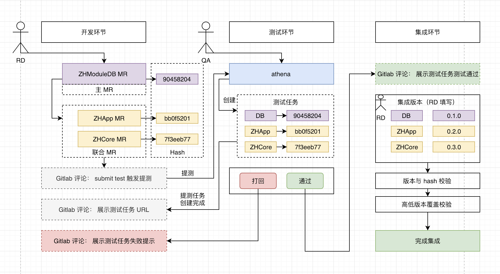

## 1. 大家常说的 CI/CD 概念？

### 1.1. 持续【集成】 => CI (continuous integration) 

- 1) 是一种软件开发实践
- 2) 用于团队开发成员经常集成它们的工作
- 3) 每次集成都通会触发一系列自动化的构建任务（包括编译，发布，自动化测试 ...)
- 4) 比如: gitlab/github 每天集成每一个开发者提交的 mr/pr

### 1.2. 持续【部署】 => CD (continuous deployment)

- 1) 通过自动化的构建、测试和部署循环来快速交付高质量的产品
- 2) 某种程度上代表了一个开发团队工程化的程度
- 3) 比如: jenkins 可扩展的持续集成引擎, 用于持续、自动的构建/测试软件项目

### 1.3. 持续【交付】=> CD (continuous delivery)

- 1) 是一种软件工程手法
- 2) 让软件产品的产出过程在一个短周期内完成, 以保证软件可以稳定, 持续的保持在随时可以释出的状况
- 3) 目标在于让软件的建置, 测试与释出变得更快以及更频繁
- 4) 这种方式可以减少软件开发的成本与时间, 减少风险

通常这些概念都只活跃于各种大型后端项目的运维领域, 但随着移动端技术越来越成熟、项目越来越大、业务越来越复杂, 对于移动端同样需要这些手段来提高团队开发效率。

## 2. 1个人的 iOS 项目开发

- 1) 自己开发完 iOS 功能模块
- 2) xcode 打包给 QA 测试
- 3) QA 测试通过后, 把包给运营提交 appstore
- 4) 出现 bug 再会转到 1) 

虽然步骤简单，但是人为的步骤很多, 且很多因素都是不可控。

## 3. 50+ 人的 iOS 项目开发

以目前我们公司内部项目的开发流程为例:

这个是我们整个移动端基于 gitlab 联合提交多个 mr 的流程，其中这一整套体系也是包含了很多的内部工具:

- 1) iOS 组件化 基础设施
- 2) mr 联合构建 流程
- 3) athena 组件集成 系统
- 4) mr 构建与分析 系统
- 5) 包括围绕 组件化 定制开发 ruby gem 命令行工具、工程 make 一键构建 ...

在这样的体系下，日常对于每一个 RD 开发功能来说，只需要关注自己的 **组件** 功能开发完成即可，其他后续的 **提测、测试、集成、打包、提审** 这一系列操作都不需要再去关系了。

## 4. 小型团队 gitlab + jenkins + fastlane + fir 实现 CI/CD

基本上已经能够满足小规模的团队日常协作开发了, 但如果推广到超过 50+ 的大团队那问题还是比较多的。

但是对于大型团队 CI/CD 流程也基本是基于这个核心骨架去扩展的，只是粒度会拆的更细，对于某个小模块可能会单独拿出来做成一个平台去维护，而不仅仅只是直接拿一些比较简单的开源产品。

其他的一些细节问题不再过多描述，也并非此系列教程所讨论的，更主要的是我并不专业 … haha ~

## 6. 进入正题: 打包机环境的配置问题

## 7. ansible 可以用来干嘛 ？

