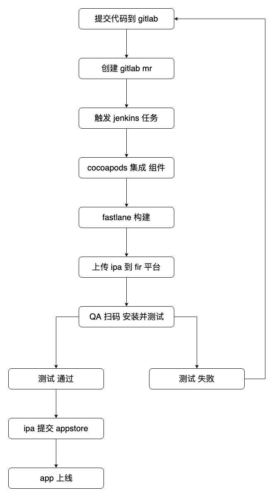
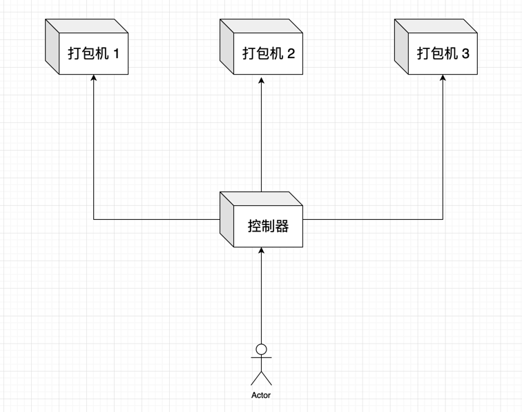
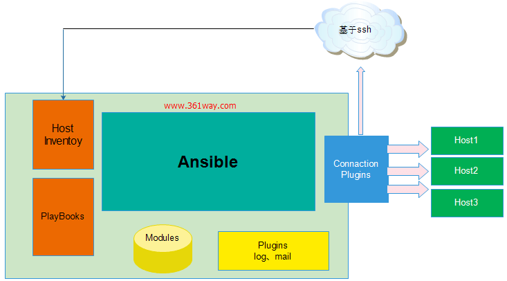

[TOC]


## 1. 大家常说的 CI/CD 概念？

### 1.1. 持续【集成】 => CI (continuous integration) 

- 1) 是一种软件开发实践
- 2) 用于团队开发成员经常集成它们的工作
- 3) 每次集成都通会触发一系列自动化的构建任务（包括编译，发布，自动化测试 ...)
- 4) 比如: gitlab/github 每天集成每一个开发者提交的 mr/pr

### 1.2. 持续【部署】 => CD (continuous deployment)

- 1) 通过自动化的构建、测试和部署循环来快速交付高质量的产品
- 2) 某种程度上代表了一个开发团队工程化的程度
- 3) 比如: jenkins + cocoapods + fastlane 可扩展的持续集成引擎, 用于持续、自动的构建/测试软件项目

### 1.3. 持续【交付】=> CD (continuous delivery)

- 1) 是一种软件工程手法
- 2) 让软件产品的产出过程在一个短周期内完成, 以保证软件可以稳定, 持续的保持在随时可以释出的状况
- 3) 目标在于让软件的建置, 测试与释出变得更快以及更频繁
- 4) 比如: 蒲公英、fir 这类用于分发 ipa 安装的平台

通常这些概念都只活跃于各种大型后端项目的运维领域, 但随着移动端技术越来越成熟、项目越来越大、业务越来越复杂, 对于移动端同样需要这些手段来提高团队开发效率。


## 2. 1个人的 iOS 项目开发

- 1) 自己开发完 iOS 功能模块
- 2) xcode 打包给 QA 测试
- 3) QA 测试通过后, 把包给运营提交 appstore
- 4) 出现 bug 再会转到 1) 

虽然步骤简单，但是人为的步骤很多, 且很多因素都是不可控。


## 3. 50+ 人的 iOS 项目开发

以目前我们公司内部项目的开发流程为例:


这个是我们整个移动端基于 gitlab 联合提交多个 mr 的流程，其中这一整套体系也是包含了很多的内部工具:

- 1) iOS 组件化 基础设施
- 2) mr 联合构建 流程
- 3) athena 组件集成 系统
- 4) mr 构建与分析 系统
- 5) 包括围绕 组件化 定制开发 ruby gem 命令行工具、工程 make 一键构建 ...

在这样的体系下，日常对于每一个 RD 开发功能来说，只需要关注自己的 **组件** 功能开发完成即可，其他后续的 **提测、测试、集成、打包、提审** 这一系列操作都不需要再去关系了。


## 4. 小型团队 gitlab + jenkins + fastlane + fir 实现 CI/CD



基本上已经能够满足小规模的团队日常协作开发了, 但如果推广到超过 50+ 的大团队那问题还是比较多的。

但是对于大型团队 CI/CD 流程也基本是基于这个核心骨架去扩展的，只是粒度会拆的更细，对于某个小模块可能会单独拿出来做成一个平台去维护，而不仅仅只是直接拿一些比较简单的开源产品。

其他的一些细节问题不再过多描述，也并非此系列教程所讨论的，更主要的是我并不专业 … haha ~


## 5. 进入正题: 配置打包机的 iOS 构建环境

### 1. 通常的情况


对于部署构建环境的人来说，重复的事情，需要完成 3 遍。

### 2. 希望的情况



- 对于部署构建环境的人来说，重复的事情，需要完成 1 遍

- 然后有 控制器 去通知所有相关的 打包机器 去执行相同的操作

### 6. ansible 可以作为【控制器】

- ansible 可以帮助我们完成一些【批量】任务，或者完成一些需要经常【重复】的任务
- 这些场景中我们都可以使用到 **ansible**
  - 同时在 **100台** 服务器 上安装 nginx 服务，并在安装后启动它们
  - 将某个文件一次性拷贝到 **100**台 服务器
  - 每当有 **新服务器** 加入工作环境时，你都要为 新服务器 **重新部署** 某个服务


## 6. ansible 架构图



----

- 1、 核心模块（Core Modules）：这些都是 ansible 自带的模块
- 2、 扩展模块（Custom Modules）：如果核心模块不足以完成某种功能，可以添加扩展模块
- 3、 插件（Plugins）：完成模块功能的补充
- 4、 **剧本（Playbooks）**：ansible 的任务配置文件，将多个任务定义在剧本中，由 ansible 自动执行
- 5、 **连接插件（Connectior Plugins）**：ansible 基于连接插件连接到各个主机上，虽然 ansible 是使用 ssh 连接到各个主机的，但是它还支持其他的连接方法，所以需要有连接插件
- 6、 **主机群（Host Inventory）**：定义哪一些需要被 ansible 管理的 **被控机** ( 安装 ansible 叫做 **主控机**)


## 7. install ansible

### 1. install

```
git clone https://github.com/ansible/ansible.git --recursive
cd ./ansible
source ./hacking/env-setup
sudo pip install -r ./requirements.txt
sudo python setup.py install
```

### 2. update

```
git pull --rebase
git submodule update --init --recursive
sudo pip install -r ./requirements.txt
sudo python setup.py install
```

### 3. ssh 配置

#### 1. 将【ansible 主控机】ssh 秘钥，添加到【被控机】

```
 ~/Desktop  cd ~/.ssh/
 ~/.ssh  ls
id_rsa      id_rsa.pub  known_hosts
 ~/.ssh  cat id_rsa.pub
.......
```

将【主控机】中的 `~/.ssh/id_rsa.pub` 如上内容,添加到【被控机】中的 `~/.ssh/authorized_keys` 文件中:

```
cat ~/.ssh/id_rsa.pub | (ssh remote_user@remote_ip "cat >> ~/.ssh/authorized_keys")
```

或者

```
ssh-copy-id remote_user@remote_ip
```

#### 2. 保存【被控机】ip 到【主控机】中 known_hosts

```
ssh-keyscan remote_ip >> ~/.ssh/known_hosts
```

#### 3. 此时 ssh remote_user@remote_ip 即可免密码登录【被控机】

```
 ~/Desktop  ssh zhihu@10.13.47.103
Last login: Mon Apr  1 23:04:21 2019 from 10.13.37.56
➜  ~
```

### 4. 设置 inventory 【被控机】列表

#### 1. 配置文件 `/etc/ansible/hosts`

配置文件路径:

```
/etc/ansible/hosts
```

> 注意: 如果没有 `/etc/ansible/` 目录，则创建。

```
/etc/ansible  sudo vim hosts
```

将需要 **被管理** 的 **远程主机** 的 IP 地址配置到 **hosts** 文件中：

```ini
[jenkins]  # 分组名
10.13.37.56  # 远程主机的 ip 地址
```

#### 2. 配置完成测试，但【报错】

配置完成之后，测试下是否配置生效

```
ansible all -m ping
```

发现 报错 

```
 ~/Desktop  ansible all -m ping
10.13.37.56 | UNREACHABLE! => {
    "changed": false,
    "msg": "Failed to connect to the host via ssh: ssh: connect to host 10.13.37.56 port 22: Connection refused",
    "unreachable": true
}
```

#### 3. 报错详细信息

```shell
 ~  ansible all -m ping -vvv
ansible 2.8.0.dev0
  config file = None
  configured module search path = [u'/Users/xiongzenghui/.ansible/plugins/modules', u'/usr/share/ansible/plugins/modules']
  ansible python module location = /Users/xiongzenghui/.pyenv/versions/2.7.10/lib/python2.7/site-packages/ansible-2.8.0.dev0-py2.7.egg/ansible
  executable location = /Users/xiongzenghui/.pyenv/versions/2.7.10/bin/ansible
  python version = 2.7.10 (default, Aug 18 2018, 02:36:32) [GCC 4.2.1 Compatible Apple LLVM 9.1.0 (clang-902.0.39.2)]
No config file found; using defaults
host_list declined parsing /etc/ansible/hosts as it did not pass it's verify_file() method
script declined parsing /etc/ansible/hosts as it did not pass it's verify_file() method
auto declined parsing /etc/ansible/hosts as it did not pass it's verify_file() method
Parsed /etc/ansible/hosts inventory source with ini plugin
META: ran handlers
<10.13.37.56> ESTABLISH SSH CONNECTION FOR USER: None
<10.13.37.56> SSH: EXEC ssh -C -o ControlMaster=auto -o ControlPersist=60s -o KbdInteractiveAuthentication=no -o PreferredAuthentications=gssapi-with-mic,gssapi-keyex,hostbased,publickey -o PasswordAuthentication=no -o ConnectTimeout=10 -o ControlPath=/Users/xiongzenghui/.ansible/cp/0ef963cf5f 10.13.37.56 '/bin/sh -c '"'"'echo ~ && sleep 0'"'"''
<10.13.37.56> (255, '', 'ssh: connect to host 10.13.37.56 port 22: Connection refused\r\n')
10.13.37.56 | UNREACHABLE! => {
    "changed": false,
    "msg": "Failed to connect to the host via ssh: ssh: connect to host 10.13.37.56 port 22: Connection refused",
    "unreachable": true
}
```

可以看出有一行明显的报错信息:

```
<10.13.37.56> ESTABLISH SSH CONNECTION FOR USER: None
```

用户名为 **None** ，也就是说 缺少 **远程服务器** 的 **名字**

#### 4. 修改 `/etc/ansible/hosts` 添加【被控机】的【用户名】

```ini
[jenkins]  # 分组名
10.13.37.56 ansible_user=zhihu # 远程主机的【ip 地址】和【用户名】
```

#### 5. 测试发现还是报错

```
 /etc/ansible  ansible all -m ping -u zhihu
10.13.37.56 | UNREACHABLE! => {
    "changed": false,
    "msg": "Failed to connect to the host via ssh: ssh: connect to host 10.13.37.56 port 22: Connection refused",
    "unreachable": true
}
```

#### 6. 在【被控机】查看 ip 地址是否正常

```
➜  /Users ifconfig | grep inet
	inet 127.0.0.1 netmask 0xff000000
	inet6 ::1 prefixlen 128
	inet6 fe80::1%lo0 prefixlen 64 scopeid 0x1
	inet6 fe80::14fe:7d54:426d:a536%en0 prefixlen 64 secured scopeid 0x6
	inet 10.13.47.103 netmask 0xffffff00 broadcast 10.13.47.255
	inet6 fe80::b938:cfd2:964f:69e0%utun0 prefixlen 64 scopeid 0x12
```

- ip 地址为 **10.13.47.103** 
- 所以 `/etc/ansible/hosts` 中配置的 ip 地址是 **错误** 的

#### 7. 修改 `/etc/ansible/hosts` 添加【被控机】的【ip 地址】

```ini
[jenkins]  # 分组名
10.13.47.103 ansible_user=zhihu # 远程主机的【ip 地址】和【用户名】
```

#### 8. 再测试 ok

```
 ~  ansible all -m ping
 [WARNING]: Platform darwin on host 10.13.47.103 is using the discovered Python interpreter at /usr/bin/python, but future installation of another
Python interpreter could change this. See https://docs.ansible.com/ansible/devel/reference_appendices/interpreter_discovery.html for more information.

10.13.47.103 | SUCCESS => {
    "ansible_facts": {
        "discovered_interpreter_python": "/usr/bin/python"
    },
    "changed": false,
    "ping": "pong"
}
```

#### 9. 也可以指定 remote user 测试

```shell
 ~  ansible all -m ping -u zhihu
 [WARNING]: Platform darwin on host 10.13.47.103 is using the discovered Python interpreter at /usr/bin/python, but future installation of another
Python interpreter could change this. See https://docs.ansible.com/ansible/devel/reference_appendices/interpreter_discovery.html for more information.

10.13.47.103 | SUCCESS => {
    "ansible_facts": {
        "discovered_interpreter_python": "/usr/bin/python"
    },
    "changed": false,
    "ping": "pong"
}
```

### 5. 测试【被控机】执行命令

```
 ~  ansible all -a "echo hello"
 [WARNING]: Platform darwin on host 10.13.47.103 is using the discovered Python interpreter at /usr/bin/python, but future installation of another
Python interpreter could change this. See https://docs.ansible.com/ansible/devel/reference_appendices/interpreter_discovery.html for more information.

10.13.47.103 | CHANGED | rc=0 >>
hello

```

截止到此，我们已经通过 ansible 成功在我们的【本地-主控机】让【远程-被控机】执行命令。s

### 6. 有一个 WARNING 

这个警告是说，我们自己没有设置 python 解释器的路径，而是使用的 ansible 自己检测到的 系统 python 解释器。

那么最简单的可以让【被控机】执行远程命令时，直接指定 python 解释器的路径:

```
 ~  ansible localhost -m ping -e 'ansible_python_interpreter="/usr/bin/env python"'

localhost | SUCCESS => {
    "changed": false,
    "ping": "pong"
}s
```

警告已经消失了，警告强迫症 ….

这是最简单的方式，后续可以有更高级的方式来指定 python 解释器的路径。s